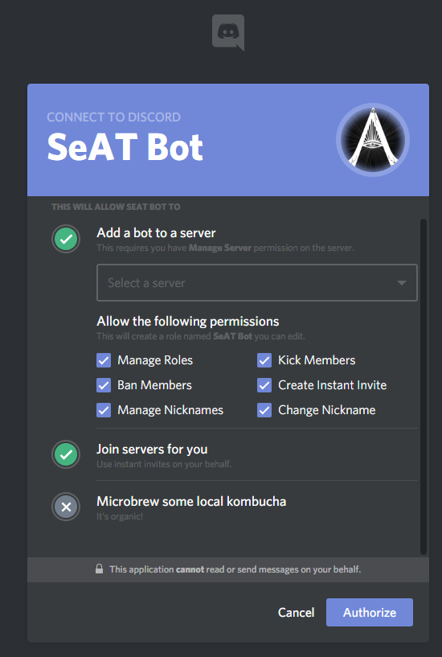
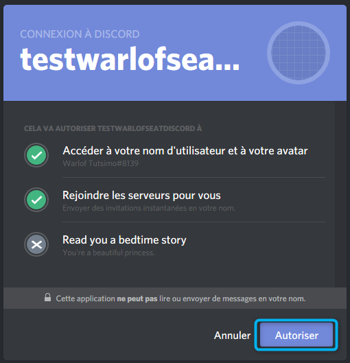

# Seat Discord Connector
A [SeAT](https://github.com/eveseat/seat) plugin which maintain user access on a Discord Guild based on defined pattern.

## Setup

### Create Application
- Go to the [following url](https://discordapp.com/developers/applications/me/create) in order to create an application and retrieve bot token.
- Give it a name and suitable description; so user will be able to know what it is related to later.
- Click on the `Add Redirect` button twice and seed spawned field with the address bellow :
  - {seat-public-url}/seat-connector/registration/discord/callback
  - {seat-public-url}/seat-connector/settings/discord/callback
- Once done, click on the `Create app` at the bottom of the form

> **NOTE**
>
> For example, if you have SeAT available on `seat.example.com`, the callbacks will be
> - `https://seat.example.com/seat-connector/registration/discord/callback`
> - `https://seat.example.com/seat-connector/settings/discord/callback`
>
> But, if you're accessing SeAT using `example.com/seat`, the callbacks will become
> - `https://example.com/seat/seat-connector/registration/discord/callback`
> - `https://example.com/seat/seat-connector/settings/discord/callback`

### Retrieving Credentials
Once your application has been created, we will need to retrieve credentials which will be used later in order to setup the connector into SeAT.

Go on the [following url](https://discordapp.com/developers/applications/me) and click on the box which is matching to the previously created application.

Take a note of the following information available in the upper top section :
- `Client ID` which is a displayed number
- `Client Secret` which is a strange text (hit on `click here to reveal` link)

Go at the footer section called `Bot` and check `Require OAuth2 access code` then confirm change using `Register modification` button at the bottom of the page.
Finally, retrieve the bot token by clicking on the `Click here to reveal` link.

### Install Package
Since SeAT 3.0 - it's become super easy to install package. Just require `warlof/seat-discord-connector`, publish vendor and run migrations scripts :)

- Firstly, run the following command `composer require warlof/seat-discord-connector`
- Finally, run migrations scripts with `php artisan migrate`

Don't forget to restart `supervisor` with `service supervisor restart` ;)

> **IMPORTANT**
>
> All upper command have to be run using the SeAT instance user `www-data`, `seat` or whatever you've done with your installation.
> They need to be run at root SeAT directory which used to be `/var/www/seat`

### Setup Package
Authenticate yourself using admin user on your SeAT instance. If all upper statements have been executed properly, you'll seed a new section into the sidebar called `Connector`.

Open it, then go into `Settings` and fill the form using collected information at the beginning of this Walkthrough.

Confirm using the `Update` button which will redirect you to Discord SSO.

In the list, select the server where the SeAT Bot have to be install, leave permissions as it and click on `Authorize` button.

*My apologies for all that french stuff, but Discord SSO is using browser settings to show content. Despite of the language, content should be similar in all countries.*

Once you've been redirected back to SeAT, you can select `Discord` and hit the `Update Sets` green button which will seed SeAT with Roles available on Discord.

### Setup Access
To build the mapping between SeAT and Discord, go into `Connector > Access Management`.
In case you're seeing no roles in the form, go into `Connector > Settings` and hit the `Update Discord Sets` button.

In **Discord Connector**, there are 6 kind of mapping called `Filter`. Their scope are explained in the table bellow.

| Filter          | Description                                                                                        |
| --------------- | -------------------------------------------------------------------------------------------------- |
| **User**        | This filter is applied to specific user group (meaning all linked characters)                      |
| **Role**        | This filter is applied to all members of specific SeAT role (ACL)                                  |
| **Corporation** | This filter is applied to all user with at least one character inside a specific corporation       |
| **Title**       | This filter is applied to all user with at least one character owning a specific corporation title |
| **Alliance**    | This filter is applied to all user with at least one character inside a specific alliance          |
| **Public**      | This filter is applied to all user                                                                 |

To create a filter, simply fill the form available on the left accordingly to your needs. Then, hit the `Add` button.
At all time, you're able to check which filter are set in the table available on the right side. You can also drop mapping using the red `Remove` button near each mapping line.

## Linking Account and Getting Invitation

As user, you will see a section called `Connector` on the sidebar. Open it and click on `Join Server`.

This will redirect your to Discord SSO with a simple form informing you that the bot will be able to collect basic information (like your Discord Unique ID and Nickname), and granted to invite you on the attached Discord Server.

Simply confirm using the `Authorize` button which will redirect you to the SeAT homepage with a green confirmation box.

You'll be invited automatically to the Discord Server and attached channels.

## Settings

The SeAT global_settings table has a key 'seat-discord-connector' used by this module.  This contains serialized settings use by this module.

| Field            | Description                                                                                                       | Default Value                          |
|------------------|-------------------------------------------------------------------------------------------------------------------|----------------------------------------|
| can_add_roles    | List of discord role names or role ids seperated by colon, that this connector is allowed to add.                 |                                        |
|                  | The special role name of "@@everyrole" acts as wildcard, while blank "" means none.                               |                                        |
|                  | A role needs to be visible through visibleRoles to be affected by this setting.                                   | @@everyrole:RoleName Example2 RemoveMe |
| can_remove_roles | List of discord role names or role ids seperated by colon, that this connector is allowed to remove.              |                                        |
|                  | The special role name of "@@everyrole" acts as wildcard, while blank "" means none.                               |                                        |
|                  | A role needs to be visible through visibleRoles to be affected by this setting.                                   | @@everyrole:RoleName Example2 RemoveMe |
| visible_roles    | List of discord role names or role ids seperated by colon, that this connector has visibiliy of from              |                                        |
|                  | the discord server. The special role name of "@@everyrole" acts as wildcard, while blank "" means none.           |                                        |
|                  | For most usage of this feature configuring visibleRoles to a non-default value will prevent all changes to roles. | @@everyrole:RoleName Example2 RemoveMe |

By default this connector expects to fully manage all roles at the Discord server.
Through careful manipulation of these values you can define the scope of roles that can be manipulated by this connector.
The use of "RoleName Example2 RemoveMe" in the default setting has been chosen to allow the administrators best guess at understanding how the field should be configured for multiple roles from looking at the setting without reading this documentation.

## Upgrade

If you're coming from a version prior to 4.x, you may want to convert your data into the new connector structure.
To do so, run the command `seat-connector:convert:discord` - it will assist you in this process.

**Callback URL have been changed, this mean you'll have to update your Discord Application.**

## Known issues

Here is a quick list of known issues (and their solution if applicable).
Purpose is to assist you in troubleshooting and lead to a resolution path.

| Problem                                                                                                                                                                                      | Solution                                                                                |
| -------------------------------------------------------------------------------------------------------------------------------------------------------------------------------------------- | --------------------------------------------------------------------------------------- |
| My job `MemberOrchestrator` is failing with the message `Client error: PATCH https://discordapp.com/api/v6/guilds/302770933452636161/members/353886200135942144 resulted in a 403 FORBIDDEN` | Ensure the bot role is at top level of your roles list (use drag and drop to sort them) |
